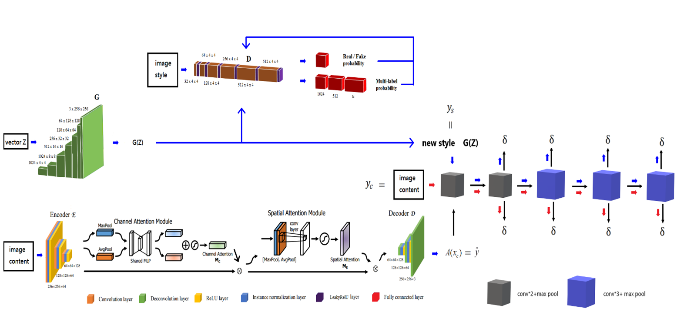
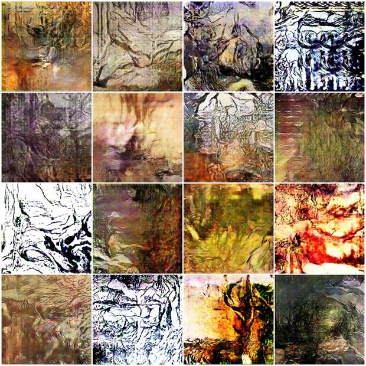
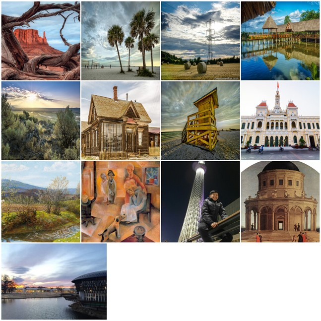
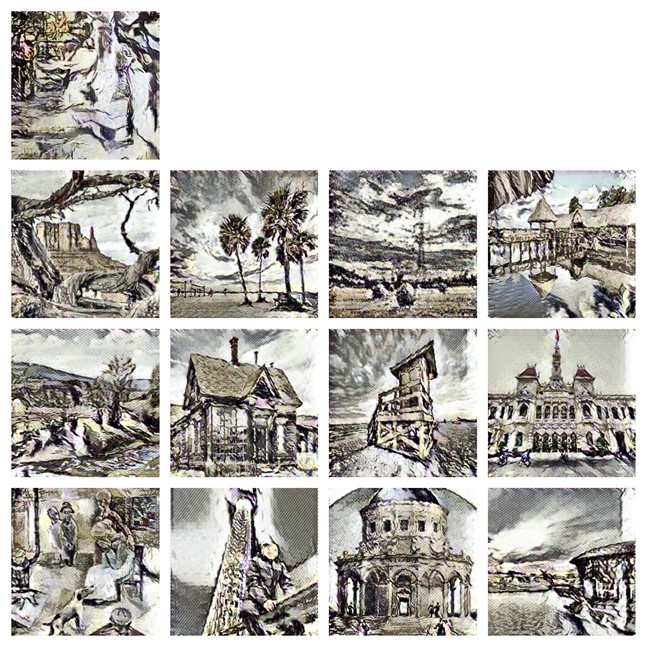
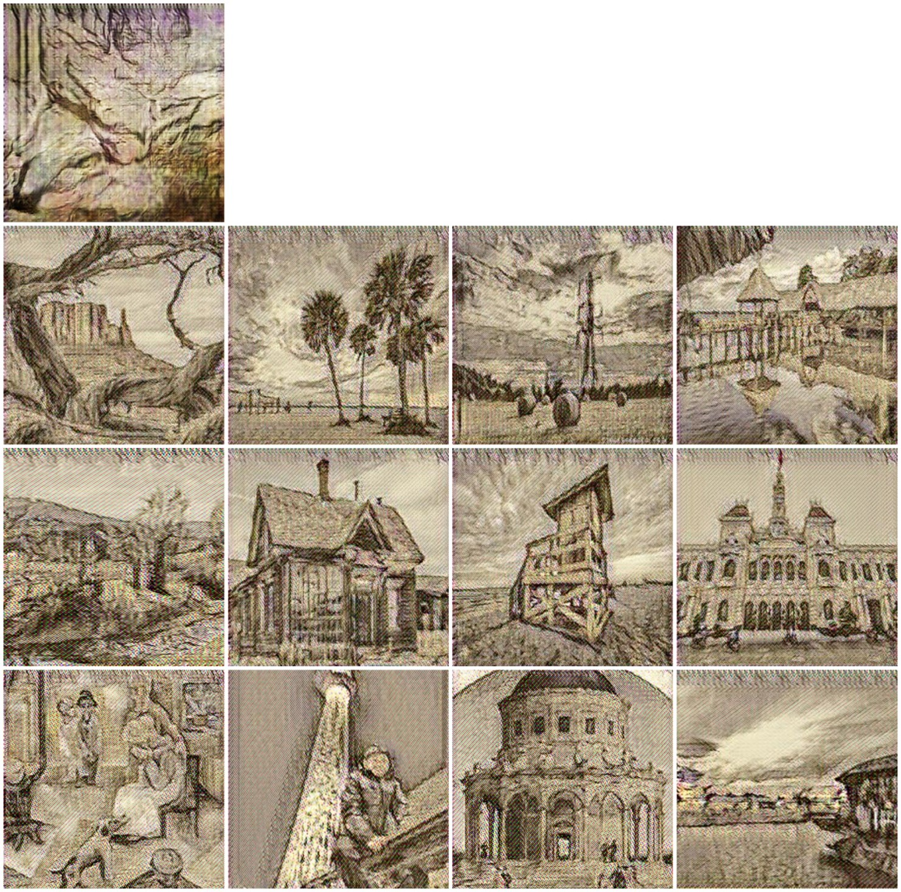
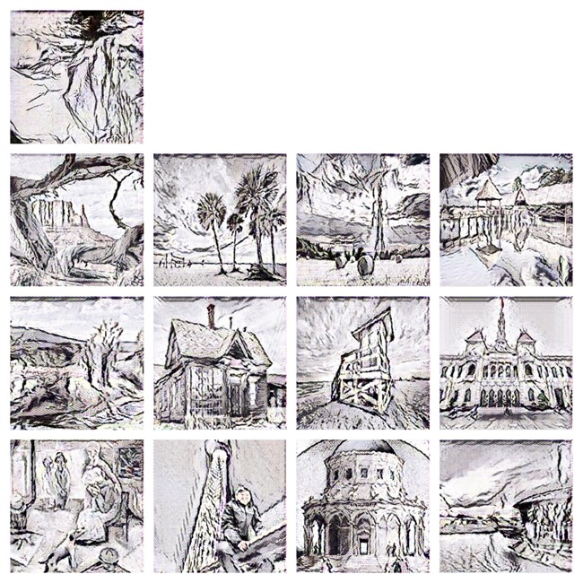

# 研究名稱: 利用生成對抗網絡與注意力模型於客製化神經風格


## 💡 研究簡介

本研究旨在結合人工智慧與藝術創作，生成具有「抽象感知風格」的新穎藝術圖片。研究核心目標為透過深度學習模型創造出兼具**抽象藝術美感與現實世界特徵**的全新藝術風格，展現人機共創的潛能。

整體架構可分為三個階段：

1. **風格生成階段**  
   透過生成對抗網絡生成具有創新風格與抽象特徵的藝術圖像，擺脫傳統風格遷移模型對既有藝術風格的依賴，實現真正「創造」而非「模仿」的生成行為。

2. **特徵提取階段**  
   利用卷積神經網絡萃取圖片的高層語意與底層像素特徵，建立多層次影像表徵，以便後續進行影像重構與強化。

3. **注意力強化與影像重建階段**  
   將卷積區塊注意力模組導入模型，使系統能自動聚焦於關鍵視覺特徵，提升生成影像的細節還原與視覺真實感。最後再透過感知損失網絡（Perceptual Loss Network）生成高品質輸出圖片，展現抽象藝術與現實世界的融合感。

綜合上述流程，本研究提出的模型能夠自動生成具有**抽象構圖**與**現實紋理**的感知藝術圖像，使使用者能以簡單的輸入創作出具獨特風格的藝術作品。此研究不僅展示人工智慧在藝術創作領域的應用潛力，也為未來「AI 藝術生成」提供技術基礎與創作框架。


## 🎯 研究動機

隨著智慧型手機與數位相機的普及，拍攝功能不斷進步，人們能輕易捕捉生活中印象深刻的景色。

然而，原始照片往往與期望的藝術效果仍有落差，因此「影像風格轉換」逐漸成為增添圖片藝術感與多樣性的關鍵技術。

儘管近十年人工智慧的快速發展帶來了重大突破，但如何讓電腦進行真正具創造力的藝術創作，仍是一項極具挑戰性的課題。

以繪畫為例，人類畫家能靈活結合內容與風格，創作出多樣的視覺藝術，而電腦生成的畫作在風格詮釋與創新性上仍存在明顯差距。

卷積神經網絡（Convolutional Neural Networks, CNN）的出現，使得影像內容與風格的分離與重組成為可能，為風格轉換提供了理論與技術基礎。

隨後，Goodfellow 等人（2014）提出生成對抗網絡（Generative Adversarial Networks, GAN），進一步減少深度學習訓練對龐大資料量的依賴，

開啟了以生成模型進行藝術創作的新契機。

然而，目前多數研究聚焦於既有藝術風格的轉換，缺乏對「抽象藝術風格創作」的探討。

為此，本研究結合生成對抗網絡（GAN）、卷積神經網絡（CNN）與卷積區塊注意力模組（Convolutional Block Attention Module, CBAM），

建立一套可自動生成抽象化藝術風格的神經影像生成模型，期望實現人工智慧在藝術創作領域中的創新應用。

## 🚀 研究架構




## ⚙️ 技術棧（Tech Stack）

| 分類 | 技術 / 工具 | 說明 |
|------|---------------|------|
| **開發語言** | Python | 主體開發語言 |
| **深度學習框架** | TensorFlow 1.x、TFLearn | 模型訓練與推論 |
| **電腦視覺工具** | OpenCV、Pillow、Scipy | 影像讀取、預處理與可視化 |
| **模型架構** | GAN、CNN、Attention | 用於生成與抽象化特徵強化 |
| **資料處理** | NumPy、Pandas | 向量化運算與資料分析 |
| **視覺化工具** | Matplotlib | 結果展示與損失曲線分析 |
| **硬體支援** | NVIDIA GPU / CUDA | 加速模型訓練與推論過程 |


## 📈 成果展示
- 訓練風格


  


- 模型產出新風格


  


- 待轉換的圖片

  


- 透過風格轉移，產出成果


  





## 📘 專案核心價值

- 🎨 **創造力提升**：結合生成對抗網絡與注意力機制，生成全新藝術風格。
- 🧠 **人工智慧應用於藝術創作**：展現 AI 在抽象藝術生成上的創造潛能。
- ⚙️ **高可操作性**：可依使用者輸入照片自動產生藝術化影像。
- 🔬 **學術研究價值**：提供 AI 藝術生成與感知美學研究的技術實驗基礎。


## 🏗️ 專案結構
```
master_thesis/
├─ bin/
│ ├─ train_dpo.py        # DPO 模型訓練入口
│ ├─ infer.py            # 模型推論腳本
├─ src/
│ └─ infer/
│   ├─ cli.py         # 參數檔
│   ├─ io_utils.py    # image工具
│   ├─ runner.py      # 執行流程
│   └─ model.py       # 模型演算法
│ └─ training/                  
│   ├─ aws.py         
│   ├─ cli.py        # 參數檔
│   ├─ config.py     # 參數架構
│   ├─ model.py      # 模型架構
│   ├─ ops.py        # 優化工具
│   ├─ paths.py      # 路徑集中管理
│   ├─ runner.py     # 訓練流程
│   ├─ trigger.py    # 重啟模組
│   ├─ utils.py      # 工具模組
│   └─ logging_utils.py # log 工具
├─ images/           # 圖片
├─ requirements.txt      # 套件需求
└─ README.md
```


## 🔧 使用說明

### (1) 訓練

``` bash
python -m src.training.app   --dataset wikiart   --train True   --epoch 6   --batch_size 16   --input_height 256 --output_height 256   --learning_rate 0.0002   --can True --wgan False   --log_dir logs --checkpoint_dir checkpoint --sample_dir sample
```

### (2) 推論

``` bash
python -m src.inference.app   --image_path ./input.jpg   --output_path ./output.png   --checkpoint_dir ./checkpoint   --input_size 256   --gpu 0
```


## 參考文獻

-   Goodfellow et al., *Generative Adversarial Nets*, NeurIPS 2014\
-   Radford et al., *DCGAN*, ICLR 2016\
-   He et al., *Deep Residual Learning*, CVPR 2016\


